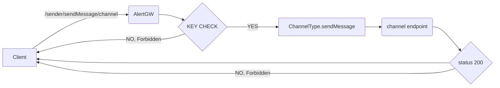

<p align="center">
  
</p>
<p align="center">
  
</p>

<h1 align="center"> On hand alert distribution!

<p align="center">
  
</p>

## AlertGateway
AlertGW is a *Python* based alert concentrator and distributor.
It is made out of three components:

 - Alert Gateway (API) ✅

  - Gateway manager (CLI) ✅  
  - Web manager (API/Web browser) ✅


## Features
 - ✔️ Easy install
 - ✔️ Centralize your alerts in one server, and distribute them to your favourite messaging platform just by sending a request to the API.
 - ✔️ Pre-stablished modules (SMTP, Telegram, Discord, Slack, Rocket chat).
 - ✔️ Create your own modules of distribution.
 - ✔️ Multiplatform

_TODO_

 - 🔜 Implement inbound channels (Not only through REST API)
 - 🔜  Accept RSS Feeds as input channel (Used to obtain NVD vulnerabilities)
 - 🔜Rsyslog as input channel
 - 🔜 Email as input channel

## Diagram and protocol stack


> Protocol stack of the application:
> `https {http/tls/tcp/ip}`
`Inbound connections -> https/4848 tcp`
`Outbound connections -> https/443 tcp (+ Custom protocols), DNS`
````mermaid
flowchart  LR  
a(Client\nrandom socket) --> b(https/4848 tcp)
f(AlertGW\nrandom socket) --> c(https/443 tcp)
````


## Application flow

## Technologies

AlertGW uses the following libraries:

- SQLalchemy - awesome ORM for python and SQL
- PyInquirer - helps me to create a amigable user interface on the CLI
- Flask - Werkzeug and jinja2 based web creator framework to python
- pyopenssl- mandatory to use HTTPS

| LIBRARY | README |
| ------ | ------ |
|  SQLalchemy | Awesome ORM for python and SQL  |
| PyInquirer | It helped me to create a user-friendly interface in the CLI. |
| Flask  | Web development framework for python based on werkzeuh and jinja2
| pyopenssl | Mandatory to use HTTPS|

And of course Dillinger itself is open source with a [public repository][dill]
 on GitHub.

## Installation

AlertGW requires  [Python 3.7](https://www.python.org/)  to run.

First of all clone the respository:

```sh
git clone https://github.com/kheabrosec/AlertGateway.git
```

If you don't have installed pip run:

 - For Debian,Ubuntu:

	```sh
	apt-get install python3-pip
	```
* For Centos,RHEL:
	```sh
	yum install python3-pip
	```
* For Windows:
	```sh
	Invoke-WebRequest  -Uri https://bootstrap.pypa.io/get-pip.py -OutFile get-pip.py
	```
	```sh
	python3 get-pip.py
	```
Install python requirements:
	```pip3 install -r requirements.txt```


## Deployment
To start using the AlertGW, first of all, you need to create a User.

 1. Execute	```python3 GatewayManager.py```	and the mangaer will ask you
    if you wan't to create a new database, say yes and give a name to
    the new database.

 2. Select ```Manage users``` and go to ```Add User```, enter a username
    and a password. **_(For security reasons, the password will not
    appear while typing)_**

 3. Now create a channel, if you want to use a pre-created channel (Telegram, Slack, Discord, Rocket) jump to step 4.
   Else, you need to create a new module, following these steps:

	* Create a new directory in `AlertGateway/channels/`
	* Create a new file `__init__.py`
	* Follow the create new custom channel guide.
 4. Create a new config file inside the module channel `(e.g, customModule.conf)` it's important to set `.conf` extension, now use the following template:
```conf
[channel]
name = CHANNELNAME
user = A_EXISTING_USER
type = NAME_OF_MODULE

[CHANNELNAME]
PARAM1 =  value
PARAM2 = value
PARAMn = value
```
