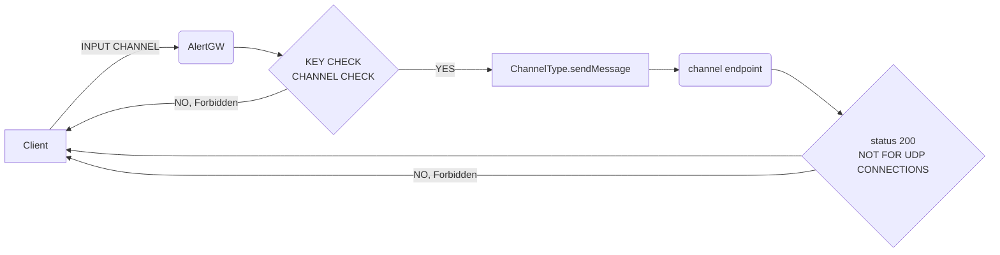

<p align="center">
  
</p>
<p align="center">
  
</p>

<h1 align="center"> On hand alert distribution!

<p align="center">
  
</p>

## AlertGateway
AlertGW is a *Python* based alert concentrator and distributor.
It is made out of three components:

 - Alert Gateway (API) ✅

  - Gateway manager (CLI) ✅  
  - Web manager (API/Web browser) ✅


## Features
 - ✔️ Easy install
 - ✔️ Centralize your alerts in one server, and distribute them to your favourite messaging platform just by sending a request to the API.
 - ✔️ Pre-stablished modules (SMTP, Telegram, Discord, Slack, Rocket chat).
 - ✔️ Create your own modules of distribution.
 - ✔️ Multiplatform

_TODO_

 - 🔜 Implement inbound channels (Not only through REST API)
 - 🔜  Accept RSS Feeds as input channel (Used to obtain NVD vulnerabilities)
 - 🔜Rsyslog as input channel
 - 🔜 Email as input channel

## Diagram and protocol stack


> Protocol stack of the application:
>
For inbound connections (Input channels) 
| MODULE| PROTOCOL|  PORT |
| ------ | ------ | ------ | -|
|  REST| HTTPS (TCP)  |  4848|
| SMTP| SMTP/STARTTLS (TCP) |  25
| SYSLOG| SYSLOG (UDP) |  514

````mermaid
flowchart  LR  
a(Client\nrandom socket) --> b(AlertGW\nhttps/4848 tcp)
a(Client\nrandom socket) --> c(AlertGW\nhttps/25 tcp)
a(Client\nrandom socket) --> d(AlertGW\nhttps/514 udp)
````
For inbound connections (Web manager)

| MODULE| PROTOCOL|  PORT |
| ------ | ------ | ------ | -|
|  REST| HTTPS (TCP)  |  443|

````mermaid
flowchart  LR  
a(Client\nrandom socket) --> b(AlertGW\nhttps/443 tcp)
````

For outbound connections (AlertGW)

| MODULE| PROTOCOL|  PORT |
| ------ | ------ | ------ | -|
| WEBHOOK| HTTPS (TCP)  |  443|
| SMTP| SMTP/STARTTLS (TCP) |  25

````mermaid
flowchart  LR  
a(AlertGW) --> b(DNS/53 tcp/udp)
a(AlertGW) --> d(POST/GET https/443 tcp)
 a(AlertGW) --> e(SMTP 25 tcp)
 a(AlertGW) --> f(Local file)
````

## Application flow

## Technologies

AlertGW uses the following libraries:

- SQLalchemy - awesome ORM for python and SQL
- PyInquirer - helps me to create a amigable user interface on the CLI
- Flask - Werkzeug and jinja2 based web creator framework to python
- pyopenssl- mandatory to use HTTPS

| LIBRARY | README |
| ------ | ------ |
|  SQLalchemy | Awesome ORM for python and SQL  |
| PyInquirer | It helped me to create a user-friendly interface in the CLI. |
| Flask  | Web development framework for python based on werkzeuh and jinja2
| pyopenssl | Mandatory to use HTTPS|
| smtpd | To use AlertGW as a smtp server|

And of course Dillinger itself is open source with a [public repository][dill]
 on GitHub.

## Installation

AlertGW requires  [Python 3.7](https://www.python.org/)  to run.

First of all clone the respository:

```sh
git clone https://github.com/kheabrosec/AlertGateway.git
```

If you don't have installed pip run:

 - For Debian,Ubuntu:

	```sh
	apt-get install python3-pip
	```
* For Centos,RHEL:
	```sh
	yum install python3-pip
	```
* For Windows:
	```sh
	Invoke-WebRequest  -Uri https://bootstrap.pypa.io/get-pip.py -OutFile get-pip.py
	```
	```sh
	python3 get-pip.py
	```
Install python requirements:
	```pip3 install -r requirements.txt```


## Deployment
To start using the AlertGW, first of all, you need to create a User.

 1. Execute	```python3 GatewayManager.py```	and the mangaer will ask you
    if you wan't to create a new database, say yes and give a name to
    the new database.

 2. Select ```Manage users``` and go to ```Add User```, enter a username
    and a password. **_(For security reasons, the password will not
    appear while typing)_**
3. It's time to create a new Input channel. AlertGW includes 3 diferent channels (REST API, SMTP, SYSLOG/UDP), in GatewayManager.py, now select manage channels, select `Create new input channel` with key arrows, select one input channel and press intro. Enter a valid port (1-65535) [By default 4848] and enter a valid ip (Select one of your interface or 0.0.0.0 to select all interfaces).
 4. To create a new Output channel, you have 2 options.
	 - ***CLI***: AlertGW it is a modular application so if there is no channel to meet your requirements, you can create a new one using the `Create new custom output channel` guide. Else, you can use a pre-created channel, first of all you need to create a `.conf` file to create the channel. Go to `AlertGateway/channels` select the channel type folder (For example telegram) and create a new file using the following template:
```conf
[channel]
name = CHANNELNAME
user = A_EXISTING_USER
type = NAME_OF_MODULE

[CHANNELNAME]
PARAM1 =  value
PARAM2 = value
PARAMn = value
```
For more information about parameters in input channels see `Output channel parameters` guide.

Now , in GatewayManager.py, select `Create new output channel` select the channel type and the config file. 
_Now you are ready to send alerts!_
-	***WEB***:  The manager is easier than the CLI, only you have to access the AlwerGateway web (443/https) with your created user, select  new output channel, and fill the options. 
For more information about parameters in input channels see `Output channel parameters` guide.
_Now you are ready to send alerts!_


